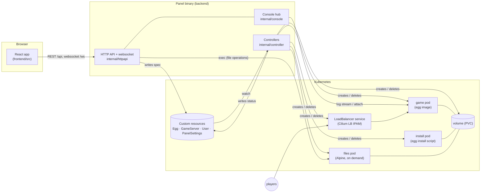
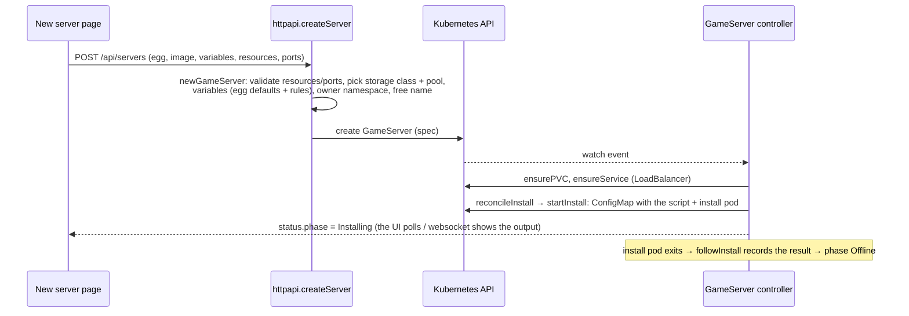
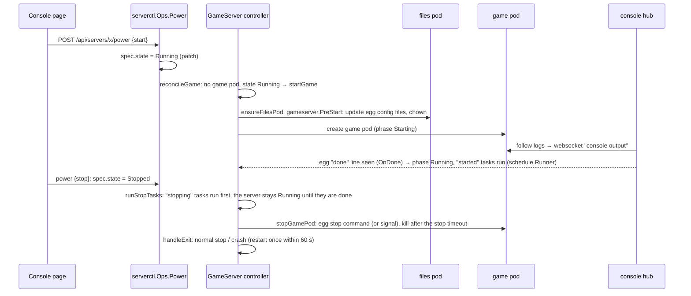

# How Kubedactyl works

This is the map for people who want to understand or change the code. `README.md` gives the overview, `docs/`
describes features, administration, installation, security and development in detail. Read this file first.

## The idea in one paragraph

Kubedactyl runs game servers from Pterodactyl/Pelican **eggs** on Kubernetes. There is no database and no
separate daemon: the panel is one Go binary that serves the web interface and the API and runs Kubernetes
**controllers**. Everything the panel knows is stored in the cluster as **custom resources** (`Egg`,
`GameServer`, `User`, `PanelSettings`). The API only writes the *desired* state (e.g. "this server should
run"); the controller makes the cluster match it (creates pods, volumes, services) and writes back what it
observed (the *status*, e.g. phase `Running`).

## Big picture



- **Game pod**: the egg's docker image running the game (`gameserver.GamePod`).
- **Install pod**: runs the egg's install script once per install revision (`gameserver.InstallPod`).
- **Files pod**: a small Alpine container that mounts the server volume; the file manager, backups and the
  pre-start steps run commands in it with `kubectl exec`-style calls (`gameserver.FilesPod`, `internal/files`).
  It only exists while it is used.
- All three mount the same volume, which can only be attached to one node, so they always run on the same node.

## Repository map

| Path | What it is |
|------|-----------|
| `backend/main.go`, `backend/wiring.go` | Start-up: flags → prepare the cluster → build controllers, services and API → serve HTTP |
| `backend/api/v1alpha1` | The custom resource types (Go structs → CRD YAML via `make generate`) |
| `backend/internal/httpapi` | API handlers, grouped by file prefix: `auth*`, `servers*`, `files_*`, `eggs*`, `users.go`, `settings.go`, `cluster.go`, `upgrade.go`; routes in `api.go`, permission rules in `servers_access.go` |
| `backend/internal/controller` | The `GameServer` controller (`gameserver*.go`), the `User` controller (namespaces, network policy), the files pod reaper |
| `backend/internal/gameserver` | Builds the Kubernetes objects of a server (pods, volume, service) and the pre-start steps |
| `backend/internal/console` | Output hub: follows pod logs, keeps a history, detects the "server is running" line |
| `backend/internal/files` | File manager (commands in the files pod), background jobs (backups, restores, URL downloads) |
| `backend/internal/egg` | Egg import (Pterodactyl/Pelican formats), validation, export, variable rules |
| `backend/internal/configfile` | Egg config file parsers (ported code, see THIRD_PARTY_NOTICES.md) |
| `backend/internal/serverctl` | Power actions, console commands, reinstall and suspend, shared by the API and the scheduler |
| `backend/internal/schedule` | Cron schedules of servers |
| `backend/internal/diagnostics`, `checks` | Server diagnostics (why players cannot connect) and the check result type shared with the cluster health |
| `backend/internal/egglibrary` | Egg library: eggs of GitHub repositories (archive download, in-memory cache) |
| `backend/internal/eggstore`, `users` | Storing eggs (create, import, update from URL, delete) and user accounts (create with namespace, changes, last-admin rule, accounts of single sign-on users) |
| `backend/internal/sso` | Single sign-on: OpenID Connect sign-in (code flow with PKCE, ID token checks) and the account a token describes; see [docs/oidc.md](docs/oidc.md) |
| `backend/internal/settings`, `clusterinfo`, `selfupgrade`, `auth`, `tenancy`, `validation`, `bootstrap`, `kube`, `httpserver` | Panel settings, cluster page and health checks, self-upgrades, passwords/sessions/tokens, user namespaces, field validation errors, start-up, Kubernetes helpers, router and security headers |
| `frontend/src/app` | Route table (`router.tsx`): which page belongs to which URL |
| `frontend/src/features/<area>` | One folder per area (servers, eggs, users, settings, …) with its `*-page.tsx` and the components/hooks only it uses; every server tab is `features/servers/<tab>-page.tsx` (URL `/servers/:server/<tab>`) |
| `frontend/src/lib` | API client (`api.ts`), data hooks (`queries/`, one file per area), types (`types/`: `api.gen.ts` generated from the Go structs, the other files name and refine them), formatting helpers |
| `frontend/src/components` | Shared components; `ui/` are library components (shadcn, Magic UI), never edited by hand |
| `charts/kubedactyl` | Helm chart |

## Flow 1: creating a server



## Flow 2: starting and stopping



The controller is a loop: every event (spec change, pod change) calls `Reconciler.Reconcile`, which reads
the current state and takes the **next step** only (create one object, send one stop command) and returns.
The next event continues. That is why functions like `reconcileGame` look like decision tables: "which
situation are we in, what is the next step?"

## Flow 3: files

1. The files page calls `POST /api/servers/x/files/session`; `files.Service.EnsurePod` marks the files as
   used and asks the controller to create the files pod (`ensureFilesPod`).
2. Every file operation (`list`, `write`, `rename`, …) goes through `requireFilesPod` and runs a command in
   the files pod (`files.Manager`).
3. `controller.FilesReaper` deletes the files pod one minute after the last operation.

## Flow 4: console

The websocket handler (`httpapi.openConsole` → `consoleSession`) subscribes to the console hub: first the
history, then live events (`console output`, `install output`, `daemon message`, `status`). Commands from the
browser go to `serverctl.Ops.Command`, which writes to the game pod's stdin (attach). The hub follows the
pod logs itself (`console/follow.go`), so the output continues when nobody is watching.

## Where do I change …?

| I want to … | Look at |
|---|---|
| add a field to servers | walk-through below |
| add an API endpoint | handler in `internal/httpapi`, route in `api.go` (right group: user/admin/files), a case in `authz_test.go`, `make docs`; frontend: `lib/api.ts` + a hook in `lib/queries/<area>.ts` |
| change how pods look (limits, security, env) | `internal/gameserver/resources.go`, `environment.go`; new pod fields must pass the admission policy `charts/kubedactyl/templates/admission-policy.yaml` |
| change the panel's Kubernetes permissions | `charts/kubedactyl/templates/rbac.yaml` (cluster role, tenant role bound per user namespace, panel-namespace role), `admission-policy.yaml`, checks in `internal/clusterinfo/identity.go`; test as the service account with `kubectl --as=… --dry-run=server` |
| change start/stop/crash behavior | `internal/controller/gameserver_game.go` |
| support another egg field | `internal/egg/parse.go` (import), `export.go` (export), `validate.go`, egg editor in `frontend/src/features/eggs/components/editor` |
| add an egg console feature (like `eula`) | `frontend/src/features/servers/egg-features/` + key in `features/servers/lib/egg-features.ts` |
| add a page | `frontend/src/features/<area>/<name>-page.tsx` + entry in `app/router.tsx` |
| add a health check | `internal/clusterinfo/health_checks.go` + `evaluate` in `health.go` |
| change what happens after start / before stop (Tasks) | `internal/schedule` (events, validation, `Runner.Started`/`StartStopping`), `controller/gameserver_game.go` (`runStopTasks`), UI `features/servers/components/schedule-list.tsx` (shared by the Schedules and Tasks tabs) |
| add a server diagnostics check | `internal/diagnostics` (`Run`, a function returning `checks.Check`, a case in the test); shown by `features/servers/diagnostics-page.tsx` |
| add a panel setting | `api/v1alpha1/settings_types.go`, `internal/settings`, settings page cards |
| change single sign-on | `internal/sso` (flow, claims), `users/oidc.go` (which account, linking), `httpapi/auth_oidc.go` (routes, cookie), `settings/oidc.go` (validation, client secret), `features/settings/components/sso-card.tsx`, `features/auth/login-page.tsx` (also the answer after `/login?sso=…`) |

## Walk-through: adding a field to servers

Example: a server option `motd` that becomes an environment variable.

1. **Type**: add the field to `GameServerSpec` in `backend/api/v1alpha1/gameserver_types.go` (optional, so
   existing objects stay valid), run `make generate` (deepcopy + CRD YAML; the panel installs the CRD on start).
2. **API**: add it to `CreateServerRequest` (`httpapi/servers_create.go`, set it in `newGameServer`) and to
   `UpdateServerRequest` (`servers_update.go`, apply it in `applyGeneral`). If users may change it, check
   `checkUserUpdate` in `servers_access.go`.
3. **Effect**: use it where it matters, here `gameserver.Environment`. If it only applies when the pod is
   created, it belongs in `RuntimeHash` (automatically, via the environment) so running servers show
   "restart required".
4. **Frontend**: `make docs` regenerates the TypeScript types from the Go structs
   (`frontend/src/lib/types/api.gen.ts`), so `GameServer` and the request types know the field; `npx tsc -b`
   shows every place that has to handle it. Add the form field in `features/servers/components/server-form.tsx`
   (create) and `settings-page.tsx` (edit).
5. **Tests and docs**: a test next to the code you changed, `make docs` for the Swagger annotations,
   `docs/` if users see it.

## Conventions

Every feature is built the same way. The rules below say where each kind of code goes; lint rules and
tests enforce the ones marked (enforced).

### Backend

- **Handlers only translate HTTP** (`internal/httpapi`): bind the request → load the object (`loadServer`,
  `loadEgg`, `loadUser`) → call the domain package → log changes with `a.audit(c, "…", key, value)` → respond.
  Rules and multi-step logic live in the domain packages: `serverctl` (power, reinstall, suspend), `eggstore`
  (create, import, update, delete eggs), `users` (accounts, last-admin rule), `settings`, `files`, `schedule`,
  `gameserver` (building pods, validating resources, ports and variables).
- **Errors** (enforced by `errors_test.go`): every failure is answered with `a.fail(c, err)`. Domain packages
  return sentinel errors (`users.ErrLastAdmin`, `eggstore.ErrInUse`, …); `domainErrors` in `httpapi/errors.go`
  maps them to HTTP status codes in one table (add new ones there instead of wrapping them in a handler).
  Handlers wrap only what has no domain error, that is checks of the request itself: `badRequest(err)` for unreadable
  requests, `forbidden`, `notFound`, `conflict`, `fieldError(status, field, err)`; a wrong field value is `validation.Field(field, err)` (422).
- **Validation errors** are `validation.Errors` (a map field → message; `egg.FieldErrors` for egg paths). The API
  answers them with 422 and `"fields"`, which the frontend shows next to the inputs.
- **Logs**: slog with a `component`; the acting user is `by`, affected objects are named by kind (`user`,
  `server`, `egg`).
- **Cached vs. uncached reads**: the controller-runtime cache can lag behind by minutes on this kind of API
  endpoint. Everything whose current state matters (pods, volumes, settings, just created objects, the admin
  count) is read with the uncached `Reader` (`mgr.GetAPIReader()`); decisions create/update use it too.
  Settings needed on every request (external domain, lifetimes, API docs switch) come from `settings.Store.Current`
  (kept in memory; a save through the store or a change the informer reports drops them, then one uncached read).

  ```go
  // servers_power.go
  func (a *API) sendPower(c *gin.Context) {
  	var req PowerRequest
  	if err := c.ShouldBindJSON(&req); err != nil {
  		a.fail(c, badRequest(err))
  		return
  	}
  	gs, ok := a.loadServer(c)
  	if !ok {
  		return
  	}
  	if err := a.Ops.Power(c, gs, req.Signal); err != nil {
  		a.fail(c, err) // serverctl.ErrSuspended → 403, ErrOffline → 409 (domainErrors)
  		return
  	}
  	a.Trigger(gs.Namespace, gs.Name)
  	c.Status(http.StatusNoContent)
  }
  ```

### Frontend

- **Types** come from the backend: `make docs` writes the Swagger file from the Go structs and
  the library `swagger-typescript-api` (dev dependency, `npm run gen:api`) turns it into `lib/types/api.gen.ts`
  (never edited by hand; names carry the Go package, e.g. `HttpapiCreateServerRequest`). The calls in `lib/api.ts`
  are written by hand (one short line each, simpler than a generated client). Go is the single source:
  a field without `omitempty` is always sent (required in TypeScript), `extensions:"x-nullable"` allows null,
  `enums:"a,b"` gives a union type. `lib/types/<area>.ts` only re-exports them under frontend names and refines
  where Go cannot say more (objects read from the cluster always have `metadata.name`). `make test` runs
  `make check-generated`, which regenerates all generated files (CRDs, deepcopy, Swagger, API types) and fails
  when they were out of date.
- **Data** (enforced by oxlint `no-restricted-imports`) has three layers:
  1. `lib/api.ts`: the only place that makes HTTP requests (`api.<area>.<action>`), plus `ApiError` and `urls`
     (download links).
  2. `lib/queries/<area>.ts`: every query (`useServer(name)`) and mutation (`useDeleteServer(name, callbacks)`).
     A mutation hook sends the request and updates the cache (`setQueryData` / invalidate the affected `keys`).
  3. Components call those hooks and only decide what the user sees (toasts, navigation, closing a dialog),
     passed as callbacks (to the hook, or to `mutate(vars, { onSuccess })` when the message needs local values).
     They never import `api`, `useQuery`, `useMutation` or the query client.
- **Showing a query**: `<QueryState query={…} skeleton={…} empty={…}>{(data) => …}</QueryState>`
  (`components/common/query-state.tsx`): skeleton while loading, the error with a retry button, `EmptyState` when
  there is nothing. List pages render their `PageHeader` first and the `QueryState` below it; detail pages whose
  header shows the object wrap a `…View`/`…Detail` component in `QueryState`.
- **Forms**: the values are one object from `useDraft(initial)` (`draft`, `set("field", value)`, `dirty`,
  `reset()`); validation messages come from the mutation: `const errors = fieldErrors(save.error)` and are shown
  with `<FieldError>`; pending state is `mutation.isPending`. Dialogs and inline forms are a `<form onSubmit>` so
  Enter submits; settings pages with several cards save with their Save button, which is enabled while `dirty`.
- **Dialogs**: confirmations use `ConfirmDialog`, with `trigger` when it belongs to one button, otherwise
  controlled by the page's single dialog state (`useState<Dialog>(null)` with `{ kind: "delete", … }`). Form
  dialogs mount their form fresh on every open. Egg console prompts (`features/servers/egg-features`) stay open
  while their action runs and are built on `AlertDialog` directly.
- **Toasts**: success "<Thing> <past participle>" ("Backup deleted"); failures `onError: failed("delete the
  backup")` (`lib/notify.ts`) → "Could not delete the backup" with the server message.
- **Where code goes**: `features/<area>/` holds the pages and the components/hooks/lib only that area uses; a
  feature may use another feature's components (servers uses `EggOption`). Every server tab lives in
  `features/servers` as `<tab>-page.tsx`, matching its URL, and gets the server from `server-layout`
  (`ServerContext`). Code the app shell or most features
  need lives in `components/common`, `components/layout`, `hooks/` and `lib/`.
- **Names**: one word per action on every layer: `list`, `get`, `create`, `update`, `delete`, plus the
  domain verbs `pull` (the server fetches a URL; "download" is only the browser download), `decompress`,
  `probe`, `transfer` (a server moves to another owner), `migrate` (a server moves to another storage class), and the actions that are not data changes: `send`
  (power, command), `run`, `reinstall`, `suspend`, `rename`, `upload`, `compress`, `open` (console, file
  session), `read`/`write` (file contents), `restore`, `import`/`export`, `start` (upgrade job), `accept` (an invite creates an account), `renew` (an invite gets a new link). Go handlers are `<verb><Thing>` (`getServerStats`, `listClusterNodes`), api methods
  `api.<area>.<verb>…` (`api.servers.getStats`), query hooks `use<Thing>` (`useServerStats`), mutation hooks
  `use<Verb><Thing>` (`useDeleteServer`). A server is passed as `server`, never `name`. Public contracts (API
  paths, JSON fields, CRD fields) are never renamed for style; code follows them. Button labels and toasts use
  words for people ("Save", "Revoke", "Download from URL").
- **Style**: named exports, kebab-case files named after their main export, destructured props with inline types;
  callbacks `onSubmit` (forms), `onConfirm` (confirmations), `onSelect` (choosing), `on<Field>Change`; imports in
  the order packages · `@/components/common` · `layout` · `ui` · `@/features` · `@/hooks` · `@/lib`.

  ```tsx
  // features/servers/components/danger-zone.tsx
  const remove = useDeleteServer(name, {
    onSuccess: () => {
      toast.success(`${serverName(server)} deleted`)
      navigate("/")
    },
    onError: failed("delete the server"),
  })
  ```

  Adding an endpoint therefore touches: handler + route (backend), `api.ts`, one hook in `lib/queries/<area>.ts`,
  the component.

### Everywhere

- **Library components** (`frontend/src/components/ui/*`) are never edited; app specific looks go into
  wrappers such as `components/common/glow-card.tsx` and `confirm-dialog.tsx`.
- **Formatting and checks**: `make fmt` (gofmt + goimports, Prettier) and `make lint` (golangci-lint with
  `backend/.golangci.yml`, deadcode, `tsc`, oxlint, knip), plus `make test` (see `docs/development.md`, *Commands*).
- **Size**: lines of at most 120 characters, functions of at most 60 lines / 40 statements (tests may be longer),
  no cognitive complexity above 20 (`gocognit`), except the ported parsers in `internal/configfile`, which stay
  close to the upstream code on purpose. A function that grows past it is split into named steps.
- **Tests**: a test file next to the code; new tests are table-driven when there are several cases
  (`cases := []struct{…}`). Fake Kubernetes clients come from `testutil.Builder(t)` (all types registered,
  test namespaces set), silent loggers from `testutil.Logger()`.

## Glossary

| Term | Meaning |
|------|---------|
| Egg | Template of a game (images, startup command, variables, install script, config file changes), from Pterodactyl or Pelican |
| PTDL / PLCN | Egg file formats of Pterodactyl (`PTDL_v2`) and Pelican (`PLCN_v3`) |
| Custom resource (CRD) | A Kubernetes object type defined by the panel (`kubectl get gameservers -A`) |
| Reconcile | One run of the controller loop for one object: compare desired and observed state, take the next step |
| spec / status | Desired state (written by the API) / observed state (written by the controller) |
| Phase | `status.phase` of a server: Pending, Installing, InstallFailed, Offline, Starting, Running, Stopping |
| "done" line | Console output from the egg (`config.startup.done`) that marks a server as running |
| Files pod | Short-lived helper pod with the server volume for file operations |
| Schedule / Task | Steps (console commands, power actions, backups) run at a cron time (schedule) or at an event, after start or before stop (task, a schedule with `event`); a step is a `ScheduleTask` in code |
