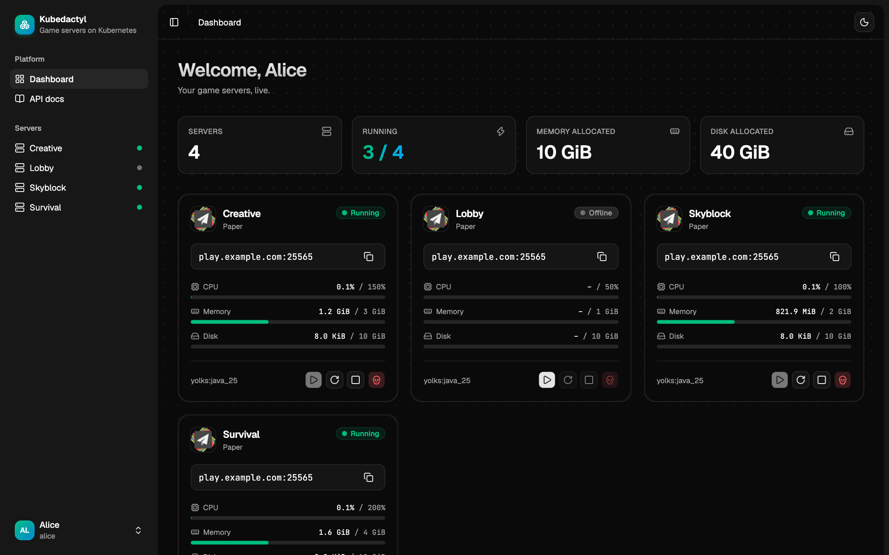
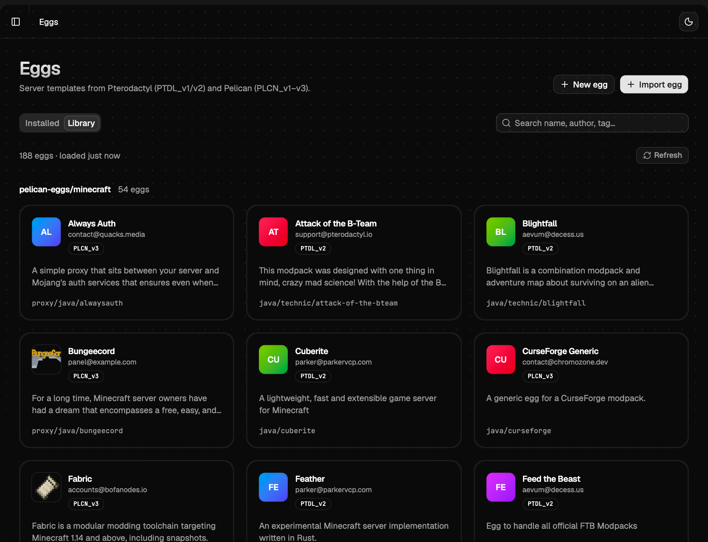
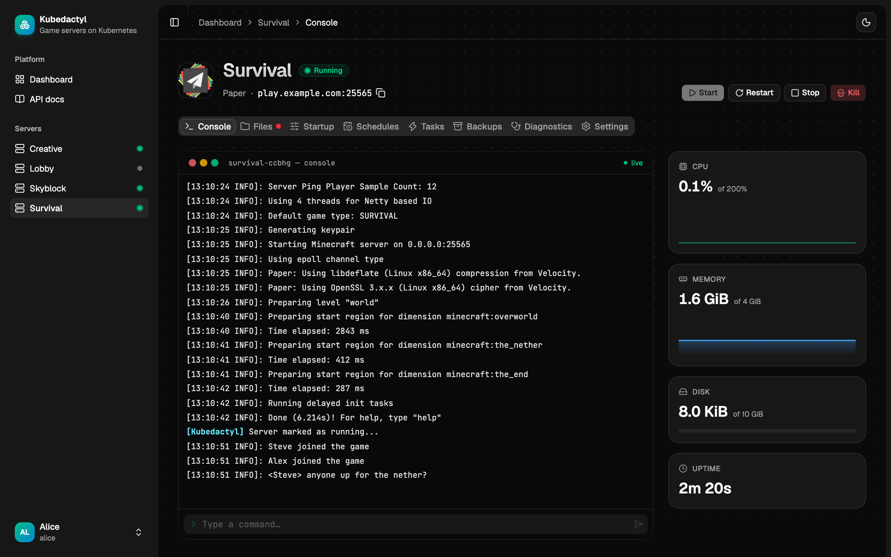
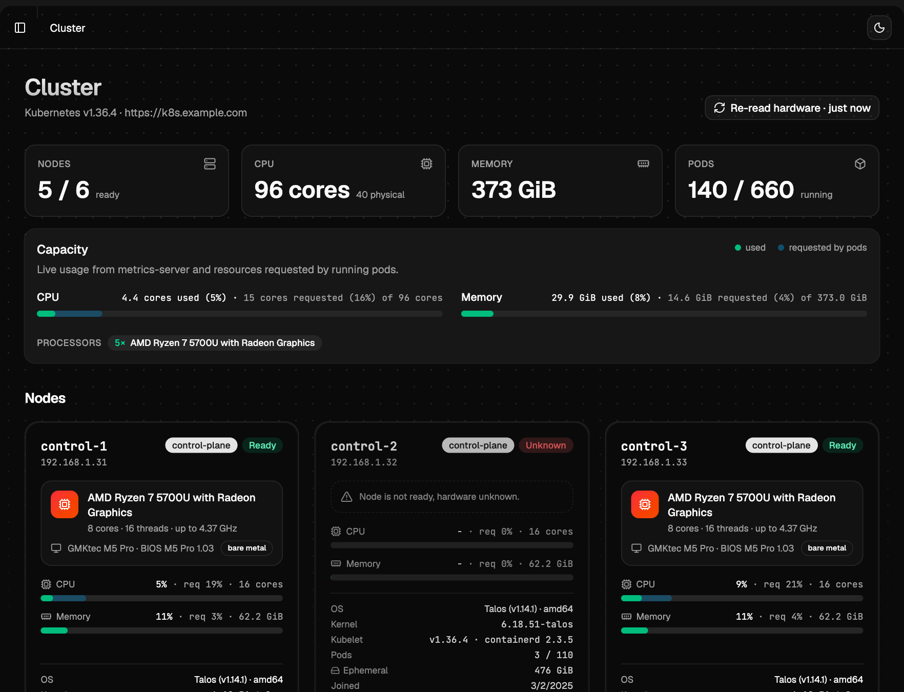
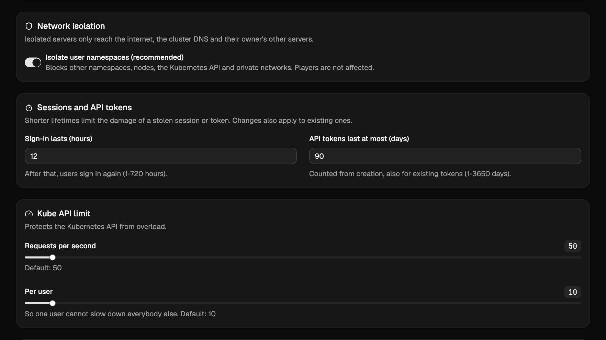

<h1 align="center">Kubedactyl</h1>

<p align="center">
  <b>The missing game server web management interface for Kubernetes.</b>
</p>

<p align="center">
  <a href="LICENSE"></a>
  
  
  
  
</p>

<p align="center">
  
</p>

Kubedactyl runs game servers the way Kubernetes is meant to run things: every server is a pod with its own volume
and load balancer address, all state lives in custom resources instead of a SQL database, and the whole panel is a
single container. It reads the **Pterodactyl and Pelican egg format**, so hundreds of existing game templates work
out of the box.

## Features

### Eggs, the way you know them

- **Your eggs just work.** Import Pterodactyl (`PTDL_v1`, `PTDL_v2`) and Pelican (`PLCN_v1` to `v3`) eggs as JSON or
  YAML, from a file or a URL. All 502 eggs of the `pelican-eggs` repositories parse. Export back to either format.
- **Built-in egg library.** Browse GitHub egg repositories right in the panel and install an egg with one click.
  Eggs can update themselves from their source every hour.
- **Egg editor.** Create eggs in a step-by-step wizard, edit, duplicate and validate them with the same rules
  Pterodactyl and Pelican use, so exports stay importable there.
- **Smart console helpers.** The egg features `eula`, `java_version`, `pid_limit`, `steam_disk_space`, `gsl_token` and
  `hytale_oauth` turn known console errors into a dialog: accept the EULA, switch the Java version or enter a new
  token with one click.

<p align="center">
  
</p>

### For server owners

- **Live console** with history and command recall, next to live CPU and memory graphs, disk usage and uptime.
- **File manager** with a code editor, drag and drop, upload, archives and downloads from a URL. The file container
  starts on demand and stops by itself when nobody uses it.
- **Backups** with one-click restore, **schedules** (cron) and **tasks** that run console commands when a server
  has started or before it stops, so players get a warning first.
- **Diagnostics** that answer "why can't my friends connect?": installation, crashes, memory, disk, DNS records as
  the internet sees them and the router forwarding of every port.
- **Crash detection** with automatic restart and a "restart required" banner when settings changed while running.
- **API tokens** and a Swagger UI for everything the web interface can do.

<p align="center">
  
</p>

### For administrators

- **Invites instead of passwords by mail.** Send a one-time link or show a QR code; the new user picks a name and
  a password. Or create users with a start password they must change.
- **Move servers between users.** A transfer keeps the files, the backups and the address.
- **Suspend** a server: it stops and is locked for its owner, nothing is deleted.
- **One namespace per user:** the servers of different users are separated by namespace and NetworkPolicy.
- **Cluster page** with nodes, hardware, live usage, the panel's identity and every permission it needs.
- **Cluster health at a glance.** A card in the sidebar checks the CRDs, the panel's permissions, nodes,
  metrics-server, Cilium, storage and the admission policy, and says what is missing.
- **Branding:** your name, tagline, logo and favicon, plus legal notice and privacy policy pages.
- **One-click upgrades.** The panel finds new versions by itself and upgrades from the settings page.

<p align="center">
  
</p>

### Under the hood

- **No SQL database.** Servers, eggs, users, invites and settings are Kubernetes custom resources stored in the
  cluster's datastore (etcd), so your usual cluster backups (etcd snapshots, Velero) cover them too. There is no
  MySQL, PostgreSQL or Redis to run, migrate or back up, and `kubectl get gameservers.kubedactyl.io -A` shows the
  same state as the panel.
- **One container.** A single Go binary with the web UI embedded. No queue worker, no cron container and no daemon
  on the nodes: the panel talks to the Kubernetes API directly.
- **Native Cilium support.** Server addresses come from Cilium LB IPAM pools, optionally as a fixed IP that is
  checked against the pool. Every port is opened as TCP and UDP. Users can move servers between pools and see a
  domain instead of the IP.
- **High performance.** The production panel idles at about 35 MiB of memory and a few millicores of CPU. Reads
  come from informer caches, values every viewer polls are fetched once and shared, and the web UI is served
  precompressed and cached. The image is about 36 MiB.
- **Rate limits that protect your cluster.** One limit for all Kubernetes API calls of the panel and one per
  user, both adjustable live in the settings. A request over the limit is refused before it starts, never
  halfway, and the footer shows the current rates.
- **Built with security in mind.** Non-root, read-only containers, no service account tokens in game pods, Pod
  Security `baseline` and a NetworkPolicy per user namespace, an admission policy that limits what the panel itself
  may change, Argon2id passwords, a strict CSP, CSRF checks, login throttling, rate limits and an audit log.
- **Modern and offline.** React 19, shadcn/ui and Tailwind CSS, dark and light theme, usable on phones. Fonts,
  styles and scripts are bundled, nothing is loaded from a CDN.

<p align="center">
  
</p>


> [!NOTE]
> Kubedactyl is young and under active development. The image is built for linux/amd64.

## Getting started

Requirements: Kubernetes 1.30 or newer, [Cilium](https://cilium.io) with LB IPAM and at least one
`CiliumLoadBalancerIPPool`, a StorageClass for the server volumes and, for CPU and memory graphs, metrics-server.

```bash
helm install kubedactyl oci://ghcr.io/syntax3rror404/charts/kubedactyl --version 0.2.61 \
  -n kubedactyl --create-namespace \
  --set panel.storageClass=<storage-class> --set panel.loadBalancerPool=<pool>
kubectl -n kubedactyl logs deploy/kubedactyl | grep setup   # one-time link for the first administrator
```

Open the link, create the administrator, import an egg (or install one from the library) and create a server.
Expose the panel through an Ingress or a Gateway API HTTPRoute (see [the chart](charts/kubedactyl/README.md)) and
run it behind TLS when it is reachable from the internet.

## Documentation

- [Features](docs/features.md): every feature in detail, eggs, how a server maps to Kubernetes objects, schedules
  and backups.
- [Administration](docs/administration.md): users, invites and permissions, panel settings, the cluster page.
- [Installation and operation](docs/installation.md): Helm chart, self-upgrades, permissions, configuration,
  cleanup and known limitations.
- [Security](docs/security.md): what the panel does to be safe on the internet.
- [Development](docs/development.md): local setup, commands, project layout and the API.
- [ARCHITECTURE.md](ARCHITECTURE.md): the big picture and where to change what. Start here when you work on the code.
- [Chart values](charts/kubedactyl/README.md) and the Swagger UI at `/swagger/` of a running panel.

## License

Kubedactyl is released under the [MIT License](LICENSE). Third-party material it contains or bundles (shadcn/ui
and Magic UI components under MIT, the config file parsers ported from Pterodactyl Wings under MIT, the Geist and
JetBrains Mono fonts under OFL-1.1) and every Go module and npm package (name, version, license) are listed in
[THIRD_PARTY_NOTICES.md](THIRD_PARTY_NOTICES.md). The build adds their license texts to `third-party-licenses.md`
(the page "Licenses" in the panel footer, also stored in the image).

Kubedactyl is an independent project. It is not affiliated with Pterodactyl or Pelican; it only reads and writes
their egg format. Pterodactyl® is a registered trademark of Dane Everitt and contributors.
